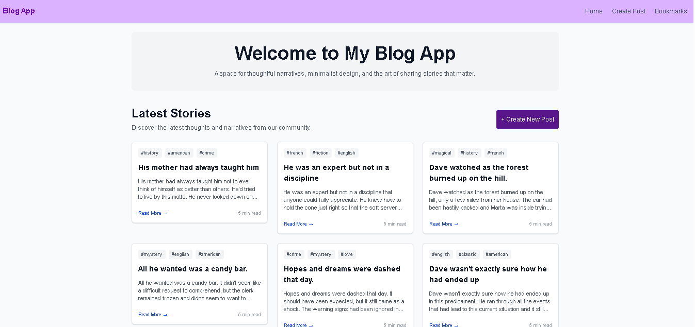
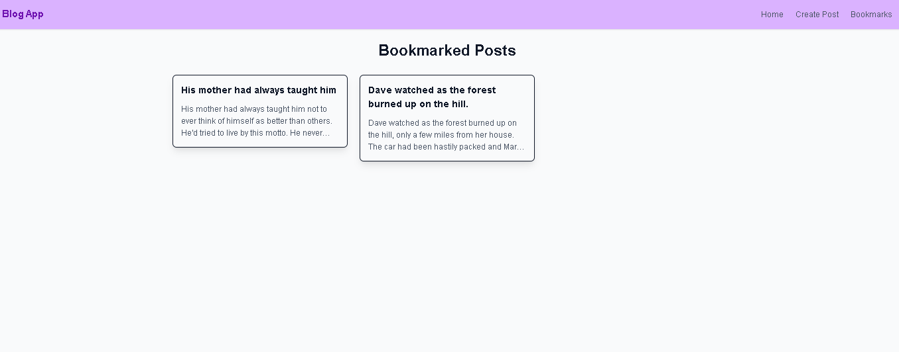
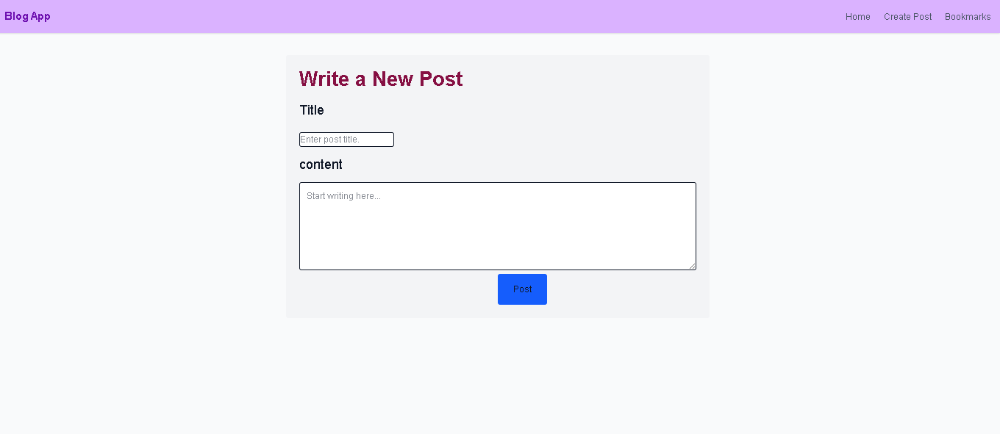

# Project Overview

the project title is called blog app it is created to practice react concepts and build a complete application using APIs,routing and reusable components.

.the app fetches blog posts from DummyJSON API and allows users to:

- view a list of blog posts
- open a single blog detail
- read comments for each posts
- bookmark and removebookmarked posts
- create new posts navigate between different pages
- fully responsive and works on mobile,tablet and desktopscreen.

# features

1.  HOME Page
    the home page displays a list of blog posts fetches from the DummyJSON API (https://dummyjson.com/posts?limit=10), displays different navigation bars.
    - fetches 10 posts when the page loads
    - display loading state while fetching data
    - display error messages if fetching fails
    - shows post titles and tags
    - clicking a post opens a details page
    - includes a button to create a new post

2.  BLOG Dtails page
    this page displays information about a single page post.
    - gets the post id from the URL by useparams()
    - fetches individual post data by using (https://dummyjson.com/posts/ :id)
    - it displays title,body,tags of a post
    - display comments related to the post from API (https://dummyjson.com/comments/post/:id)
    - includes bookmark functionality
    - includes back buuton that goes back to home page

3.  Bookmark system
    it uses jotai for global state management.
    the user can: - add a post to bookmark - remove a post from bookmark
    -view saved posts on book mark page
    the bookmark state is shared between:
    - Blog details page
    - Bookmark page

      how it works??
      click bookmark button -> update jotai atom -> bookmark recieve data -> display saved post

4.  Create post page
    allows a user to create a new blog post.
    - form with title and content
    - prevents empty title
    - redirect back to home after submitting

5.  Bookmark page
    displays all saved posts.
    - reads bookmarks from jotai
    - displays bookmarked posts
    - shows "no book mark yet when empty
    - shows sucessfuly submitted after we submit

    # i used

    ## React

    used for bulding reuseable ui components.

        concepts practiced:
        - components
        - props
        - state
        - conditional rendering and
        - different hooks
        ## react router
         used for navigation between pages
          -routes , route , link , usenavigate ,useparams
        ## jotail
           used for global state managment.
            for - managing bookmark posts
                - sharing bookmark data between componenets
        ##  tailwind css
           used for styling.
           like : responsive layout , grid system , buttons, spacing , hove effect.....
        ## DummyJson API
         used as a source of blog data.
          provides :
                    - post
                    - comments
                    - users

    # Responsive design

    this app design to work on: - mobile phone - tablets - desktop screen

# Screenshots

### Home Page

### Blog Details Page

### Bookmarks Page

### Create Post Page

